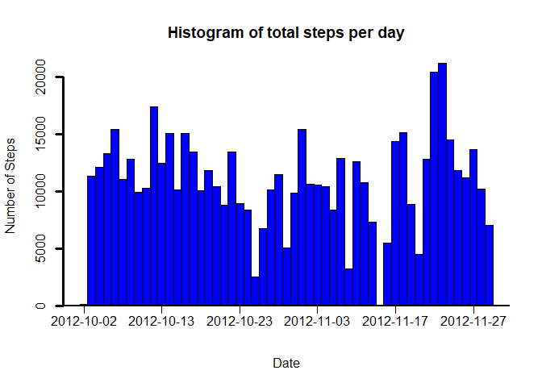
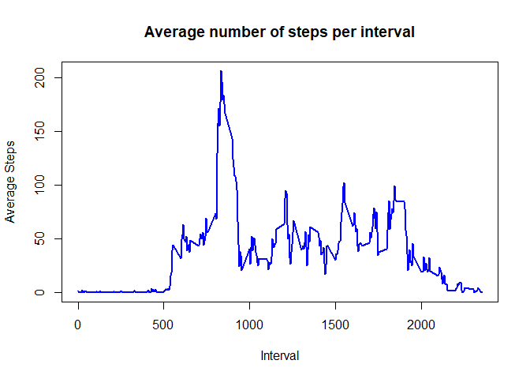
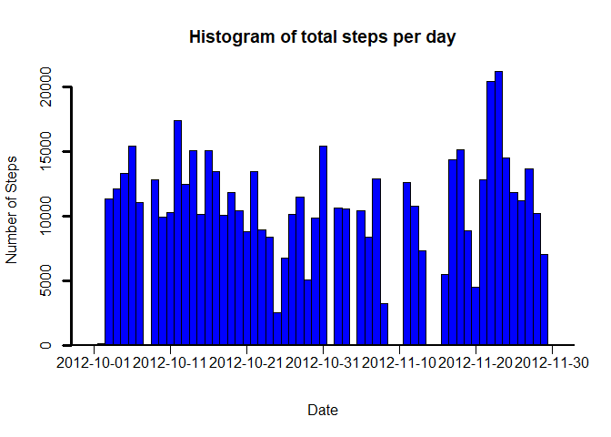
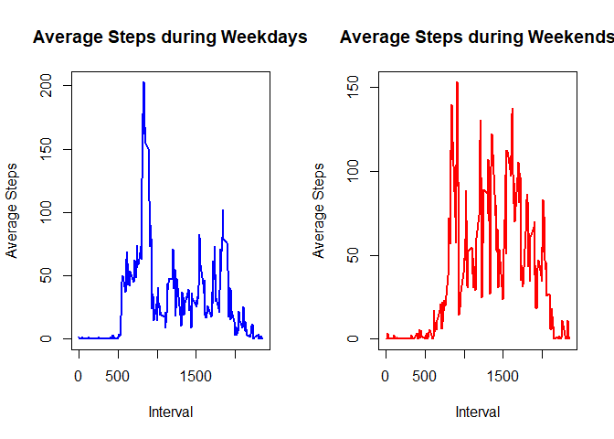

The present document details the steps taken to successfully complete the peer-graded assignment 1, from the *Reproducible Research* course given in Coursera.

## Loading and preprocessing the data

The first step is to load in the data. This part assumes that the file *activity.csv* is present in the working directory. Afterwards we can take a quick look at it.


```r
data <- read.csv('activity.csv')
head(data,10)
```

```
##    steps       date interval
## 1     NA 2012-10-01        0
## 2     NA 2012-10-01        5
## 3     NA 2012-10-01       10
## 4     NA 2012-10-01       15
## 5     NA 2012-10-01       20
## 6     NA 2012-10-01       25
## 7     NA 2012-10-01       30
## 8     NA 2012-10-01       35
## 9     NA 2012-10-01       40
## 10    NA 2012-10-01       45
```

```r
summary(data)
```

```
##      steps            date              interval     
##  Min.   :  0.00   Length:17568       Min.   :   0.0  
##  1st Qu.:  0.00   Class :character   1st Qu.: 588.8  
##  Median :  0.00   Mode  :character   Median :1177.5  
##  Mean   : 37.38                      Mean   :1177.5  
##  3rd Qu.: 12.00                      3rd Qu.:1766.2  
##  Max.   :806.00                      Max.   :2355.0  
##  NA's   :2304
```


It can be seen that the *date* column was loaded as a character variable. Furthermore, the *interval* column ranges from 0 to 2355, that is, from 00:00h to 23:55h in intervals of 5 minutes. Therefore, these two columns can be converted into a single DateTime object. 

To be able to convert the *interval* column to a time series object, some additional formatting has to be made, more specifically, leading zeros have to be added so that each character is of length 4.


```r
data$interval <- sprintf("%04d",data$interval) #Add leading 0's to create a 4 digit number
data$DateTime <- paste(data$date,data$interval)
data$DateTime <- as.POSIXlt(data$DateTime,format='%Y-%m-%d %H%M',tz='UTC')

dataDT <- data[,c('steps','DateTime')] #Simplified data frame with only steps and DateTime

head(dataDT,10)
```

```
##    steps            DateTime
## 1     NA 2012-10-01 00:00:00
## 2     NA 2012-10-01 00:05:00
## 3     NA 2012-10-01 00:10:00
## 4     NA 2012-10-01 00:15:00
## 5     NA 2012-10-01 00:20:00
## 6     NA 2012-10-01 00:25:00
## 7     NA 2012-10-01 00:30:00
## 8     NA 2012-10-01 00:35:00
## 9     NA 2012-10-01 00:40:00
## 10    NA 2012-10-01 00:45:00
```


## What is mean total number of steps taken per day?

A histogram that shows the number of steps taken each day can be plotted as follows.


```r
daily_steps <- aggregate(formula=steps ~ as.Date(dataDT$DateTime),
                         data=dataDT,
                         FUN=sum,
                         na.action=na.omit
)

colnames(daily_steps) <- c('date','steps')

#Plot the (pseudo)-histogram
bp <- barplot(daily_steps$steps,
              xlab='Date',ylab='Number of Steps',
              main='Histogram of total steps per day',
              lwd=3,col='blue',space=0,xaxt='n'
)

#Extra code to "prettify" the plot
labels <- seq(1,dim(bp)[1],by=10)
xlabels=daily_steps[labels,'date']
abline(h=-50,lwd=2)
axis(1, at=bp[labels,1], labels = FALSE,pos=0)
text(bp[labels,1],-200,labels=xlabels,pos=1,xpd=TRUE)
```

<!-- -->


Similarly to how the histogram was created, the *aggregate* function can be used to calculate the mean and median of steps taken per day.


```r
#Mean steps per day
mean_daily_steps <- aggregate(formula=steps ~ as.Date(dataDT$DateTime),
                              data=dataDT,
                              FUN=mean,
                              na.action=na.omit
)

colnames(mean_daily_steps) <- c('date','mean.steps')

#Median steps per day
median_daily_steps <- aggregate(formula=steps ~ as.Date(dataDT$DateTime),
                                data=dataDT,
                                FUN=median,
                                na.action=na.omit
)

colnames(median_daily_steps) <- c('date','median.steps')

#Merge both dataframes and show
merge(mean_daily_steps,median_daily_steps,by='date')
```

```
##          date mean.steps median.steps
## 1  2012-10-02  0.4375000            0
## 2  2012-10-03 39.4166667            0
## 3  2012-10-04 42.0694444            0
## 4  2012-10-05 46.1597222            0
## 5  2012-10-06 53.5416667            0
## 6  2012-10-07 38.2465278            0
## 7  2012-10-09 44.4826389            0
## 8  2012-10-10 34.3750000            0
## 9  2012-10-11 35.7777778            0
## 10 2012-10-12 60.3541667            0
## 11 2012-10-13 43.1458333            0
## 12 2012-10-14 52.4236111            0
## 13 2012-10-15 35.2048611            0
## 14 2012-10-16 52.3750000            0
## 15 2012-10-17 46.7083333            0
## 16 2012-10-18 34.9166667            0
## 17 2012-10-19 41.0729167            0
## 18 2012-10-20 36.0937500            0
## 19 2012-10-21 30.6284722            0
## 20 2012-10-22 46.7361111            0
## 21 2012-10-23 30.9652778            0
## 22 2012-10-24 29.0104167            0
## 23 2012-10-25  8.6527778            0
## 24 2012-10-26 23.5347222            0
## 25 2012-10-27 35.1354167            0
## 26 2012-10-28 39.7847222            0
## 27 2012-10-29 17.4236111            0
## 28 2012-10-30 34.0937500            0
## 29 2012-10-31 53.5208333            0
## 30 2012-11-02 36.8055556            0
## 31 2012-11-03 36.7048611            0
## 32 2012-11-05 36.2465278            0
## 33 2012-11-06 28.9375000            0
## 34 2012-11-07 44.7326389            0
## 35 2012-11-08 11.1770833            0
## 36 2012-11-11 43.7777778            0
## 37 2012-11-12 37.3784722            0
## 38 2012-11-13 25.4722222            0
## 39 2012-11-15  0.1423611            0
## 40 2012-11-16 18.8923611            0
## 41 2012-11-17 49.7881944            0
## 42 2012-11-18 52.4652778            0
## 43 2012-11-19 30.6979167            0
## 44 2012-11-20 15.5277778            0
## 45 2012-11-21 44.3993056            0
## 46 2012-11-22 70.9270833            0
## 47 2012-11-23 73.5902778            0
## 48 2012-11-24 50.2708333            0
## 49 2012-11-25 41.0902778            0
## 50 2012-11-26 38.7569444            0
## 51 2012-11-27 47.3819444            0
## 52 2012-11-28 35.3576389            0
## 53 2012-11-29 24.4687500            0
```


## What is the average daily activity pattern?

The average daily activity pattern can be plotted with a line plot as follows, where the x-axis corresponds to the 5-minute intervals, and the y-axis corresponds to the average across all the days in the dataset.

First, the data is split by intervals and the mean is calculated for each interval.


```r
data_int <- split(data$steps,data$interval)
avg_steps_int <- sapply(data_int,mean,na.rm=TRUE)

#Plot the time-series avg
plot(names(data_int),avg_steps_int,
     type='l',col='blue',lwd=2,
     main='Average number of steps per interval',
     xlab='Interval',ylab='Average Steps'
)
```

<!-- -->


To find the interval that, on average, contains the maximum number of steps, the match function can be applied to the created vector, with the *max* function as a first argument. The index returned can then be used to subset the average steps per interval vector to get the interval which corresponds to the maximum average number of steps across all days.


```r
indx <- match(max(avg_steps_int),avg_steps_int)
names(avg_steps_int)[indx]
```

```
## [1] "0835"
```


## Imputing missing values

It should be noted that there are a number of days/intervals where there are missing values, which may introduce bias into some calculations of the data. The total number of missing values is:


```r
sum(is.na(data$steps))
```

```
## [1] 2304
```


There are a variety of ways to impute missing values, depending on the situation. With the current dataset, seems that when NA's appear, they appear for the entirety of the day. This assumption can be checked with the following code:


```r
#Split by days (in chunks of 288, since there are 288 5-minute intervals per day)
temp <- split(data$steps, (seq(nrow(data))-1) %/% 288)
temp2 <- lapply(temp,is.na)
sapply(temp2,sum)
```

```
##   0   1   2   3   4   5   6   7   8   9  10  11  12  13  14  15  16  17  18  19 
## 288   0   0   0   0   0   0 288   0   0   0   0   0   0   0   0   0   0   0   0 
##  20  21  22  23  24  25  26  27  28  29  30  31  32  33  34  35  36  37  38  39 
##   0   0   0   0   0   0   0   0   0   0   0 288   0   0 288   0   0   0   0 288 
##  40  41  42  43  44  45  46  47  48  49  50  51  52  53  54  55  56  57  58  59 
## 288   0   0   0 288   0   0   0   0   0   0   0   0   0   0   0   0   0   0   0 
##  60 
## 288
```


The results confirm the hypothesis, wherein if NA's occur, they will occur for the entirety of the day. Therefore, it was decided to simply impute these missing values with 0, as the mean/median for said day would be 0. This way, there is no impact in the mean and median total number of steps taken per day. The only difference is that now, with the first histogram, there will be empty spaces between some columns, corresponding to the days that were previously populated with NA's.


```r
new_data <- data.frame(data)
new_data[is.na(new_data)] = 0

#Replot the previous histogram
daily_steps <- aggregate(formula=steps ~ as.Date(new_data$DateTime),
                         data=new_data,
                         FUN=sum,
                         na.action=na.omit
)

colnames(daily_steps) <- c('date','steps')

bp <- barplot(daily_steps$steps,
              xlab='Date',ylab='Number of Steps',
              main='Histogram of total steps per day',
              lwd=3,col='blue',space=0,xaxt='n'
)

labels <- seq(1,dim(bp)[1],by=10)
xlabels=daily_steps[labels,'date']
abline(h=-50,lwd=2)
axis(1, at=bp[labels,1], labels = FALSE,pos=0)
text(bp[labels,1],-200,labels=xlabels,pos=1,xpd=TRUE)
```

<!-- -->


## Are there differences in activity patterns between weekdays and weekends?

To verify the difference in activity patterns between weekdays and weekends, a new column will be added to the new dataframe, that evaluates to the day of the week of the corresponding date.


```r
new_data$weekday <- new_data[,'DateTime']$wday
```


To easily split the data into weekdays and weekends, a function was created that assigns the value 2 if the date is during the weekend, and the value 1 if the day is during the week. Then, a new column is added to the data frame using the *apply* function with the new function created. The data frame can then be split into week and weekend days. 


```r
f = function(x) {
    #x is the row
    if (x[5] == 6 | x[5] == 0) {
        2
    } else {
        1
    }
}

new_data$fact <- apply(new_data,1,f)

data_week <- new_data[new_data$fact == 1, ]
data_weekend <- new_data[new_data$fact==2, ]
```


To compare the average number of steps per 5-minute interval across weekdays and weekends, the data needs to first be split again by the intervals. Then, the mean can be calculated for each interval, which will result in two vectors, one for the weekdays and one for the weekends.


```r
split_data_week <- split(data_week$steps,data_week$interval)
split_data_weekend <- split(data_weekend$steps,data_weekend$interval)

#Find mean for each interval
mean_steps_week <- sapply(split_data_week,mean)
mean_steps_weekend <- sapply(split_data_weekend,mean)
```


With the necessary vectors and information, a panel plot can be created with the following code:


```r
par(mfcol=c(1,2))

plot(names(mean_steps_week),mean_steps_week,
     type='l',col='blue',lwd=2,
     xlab='Interval',ylab='Average Steps',
     main='Average Steps during Weekdays'
)

plot(names(mean_steps_weekend),mean_steps_weekend,
     type='l',col='red',lwd=2,
     xlab='Interval',ylab='Average Steps',
     main='Average Steps during Weekends'
)
```

<!-- -->

